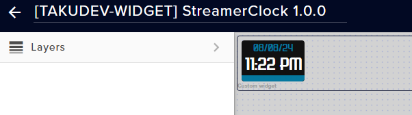

# 🕰️ streamer-clock (Streamelements Widget)

[:computer: Downloading & Release notes](https://github.com/jojo58fr/streamer-clock/releases)   |  [:warning: Known issues](#known-issues) | [:bug: Report bugs](https://github.com/jojo58fr/streamer-clock/issues)

> A simple clock for your stream ! Give Date and hours with a bunch of customizations.
No other softwares and plugins are needed. Just Streamelements.
Feel free to contribute to this projects, its one of free widget that i just [release here](https://github.com/jojo58fr/free-streamelements-widgets). It's a fork from a gist with lots of improvements and changing to use it with streamelements. 

### Copyright

Copyright (c) 2020 Joachim Miens (contact@joachim-miens.com)

This application is licensed under the MIT License (see below & COPYING).

This base project is a fork of a gist as maintained by [sam0737/clock.html](https://gist.github.com/sam0737/a0ee8ca253fc5c84b2aa2ac018f7b8ad)

### Known Issues

### Contributors

### License
See licence file for more info
